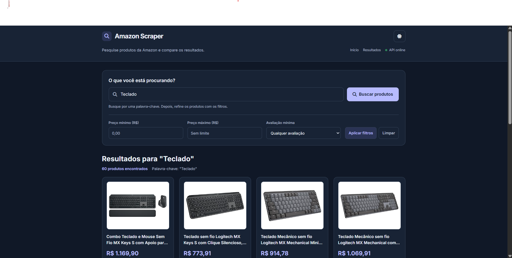
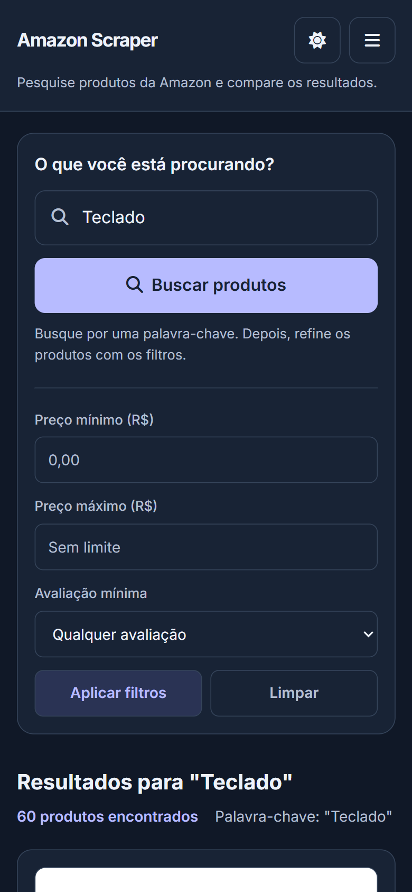

# Amazon Scraper de Produtos

[]()
[]()
[]()
[]()
[]()
[]()

## Sobre o projeto

O **Amazon Scraper de Produtos** é uma aplicação full stack em Node.js para consultar, tratar e exibir produtos da Amazon Brasil. A solução combina scraping estruturado, API REST e uma interface web responsiva para pesquisar e comparar produtos.

O projeto demonstra consumo e processamento de HTML, normalização de dados, desenvolvimento de APIs REST, cache, rate limit, headers de segurança, tratamento de erros e construção de interface com HTML, CSS, JavaScript, Vite e Tailwind CSS.

> O projeto depende da estrutura HTML de um serviço externo. Alterações realizadas pela Amazon podem exigir ajustes no processo de scraping.

## Arquitetura do Projeto

```text
Frontend (Vite + Tailwind CSS)
        |
API REST (Node.js + Express)
        |
Axios
        |
JSDOM
        |
Processamento e normalização dos dados
        |
Resposta JSON
```

O frontend consome a API e apresenta os produtos em uma grade responsiva. No backend, o Axios realiza as requisições HTTP, o JSDOM interpreta o HTML e os dados coletados são normalizados antes do retorno em JSON.

## Funcionalidades

### Scraping e dados

- Coleta automatizada de produtos da Amazon Brasil;
- pesquisa por palavra-chave;
- parsing do HTML com JSDOM;
- normalização de título, preço, avaliação, reviews, imagem e URL;
- disponibilização dos resultados por API REST em JSON;
- cache em memória com TTL.

### Interface

- Layout responsivo para desktop e mobile;
- busca com feedback de carregamento;
- filtros locais por preço mínimo, preço máximo e avaliação mínima;
- contador consistente após filtros;
- scroll progressivo para renderização dos cards;
- modo claro/escuro com persistência;
- retry manual para repetir a última busca tentada;
- tratamento amigável de erros HTTP e falhas externas;
- status discreto da API com `API online` ou `API indisponível`;
- footer com ano dinâmico.

### Observabilidade, desempenho e segurança

- Endpoint de health check;
- endpoint de métricas mantido no backend;
- rate limit para mitigar abuso;
- headers de segurança com Helmet;
- compressão das respostas;
- registro de requisições;
- validação dos parâmetros de entrada;
- tratamento centralizado de erros.

## Endpoints

```http
GET /api
GET /api/health
GET /api/metrics
GET /api/scrape?keyword=produto
```

O parâmetro `keyword` define o termo utilizado na pesquisa dos produtos.

## Interface

### Desktop



### Mobile



## Tecnologias

### Backend

- Node.js;
- Express;
- Axios;
- JSDOM;
- Helmet;
- Morgan;
- Compression;
- Express Rate Limit.

### Frontend

- Vite;
- Tailwind CSS;
- JavaScript;
- Vitest;
- JSDOM.

## Como executar

### Pré-requisitos

- Git;
- Node.js `^20.19.0 || >=22.12.0`;
- npm.

### Clonar o repositório

```powershell
git clone https://github.com/NatanLuz/amazon_scraper_fullstackAPI.git
cd amazon_scraper_fullstackAPI
```

### Instalar as dependências

Na raiz, instale as dependências do backend e do frontend de forma reproduzível com os lockfiles:

```powershell
npm run install-all
```

Para instalar separadamente, use `npm run install-server` e `npm run install-client`.

### Executar em desenvolvimento

Em um terminal, inicie o backend:

```powershell
npm run dev
```

Em outro terminal, inicie o frontend:

```powershell
cd client
npm run dev
```

A interface ficará disponível em:

```text
http://localhost:5173
```

A API ficará disponível em:

```text
http://localhost:3000
```

### Executar build de produção

Para compilar o frontend e servi-lo pelo backend:

```powershell
npm run build
npm start
```

Depois do build, a aplicação fica disponível em `http://localhost:3000`.

`npm run build:prod` reutiliza o build sem instalar dependências. `npm run deploy` compila e inicia localmente; não publica em uma plataforma externa.

## Testes

Execute os testes do backend:

```powershell
npm run test:backend
```

Execute os testes do frontend:

```powershell
cd client
npm test -- --run
```

Estado atual validado:

- backend: 9 testes;
- frontend: 14 testes;
- total: 23/23;
- build do client: OK;
- build pela raiz: OK.

## Verificação funcional

Após iniciar backend e frontend:

1. Realize uma busca por palavra-chave;
2. verifique cards, imagens, preços, avaliações, reviews e links;
3. aplique filtros de preço e avaliação;
4. confirme o contador de resultados;
5. teste o retry manual após uma falha simulada ou real;
6. confirme o status `API online` ou `API indisponível`.

## Estrutura do projeto

```text
amazon_scraper_fullstackAPI/
├── server/
├── client/
├── docs/
│   └── images/
├── package.json
├── README.md
└── ...
```

- `server/`: API REST, scraping, cache, métricas e middlewares;
- `client/`: interface web desenvolvida com Vite, Tailwind CSS e JavaScript;
- `client/src/__tests__/`: testes automatizados executados com Vitest;
- `docs/images/`: screenshots locais usadas na documentação;
- `package.json`: dependências e scripts do projeto;
- `README.md`: documentação técnica principal.

## Autor

**Natan Da Luz**

- LinkedIn: [linkedin.com/in/natandaluz](https://www.linkedin.com/in/natandaluz/)
- Portfólio: [portfolionatan.vercel.app](https://portfolionatan.vercel.app/)
- E-mail: [natandaluz01@gmail.com](mailto:natandaluz01@gmail.com)

## Licença

Este projeto está sem uma licença definida no momento.
